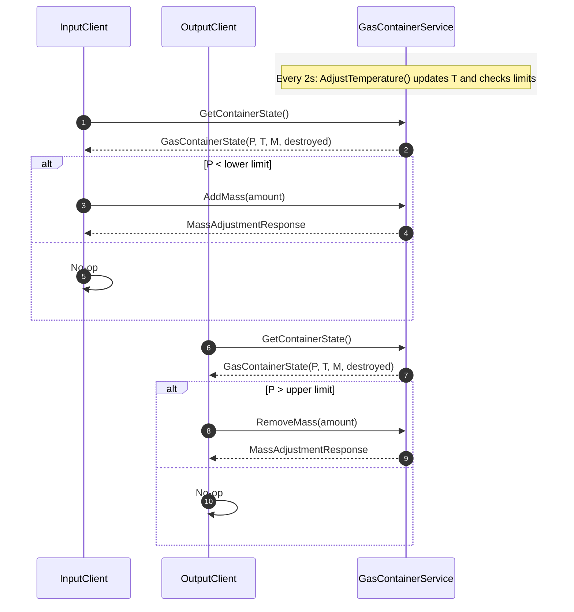

# Gas Pressure Components Container (gRPC)

A distributed simulation of gas pressure in a container, implemented with gRPC in .NET 8. The system models the physics-inspired behavior of gas in a sealed container and exposes a contract-driven gRPC API. It consists of three separate processes that communicate over HTTP/2:

- Container (Server): `GrpcGasPressure`
- Input component (Client): `InputClient`
- Output component (Client): `OutputClient`

## Overview

The container tracks temperature (K), gas mass, and derived pressure. Every 2 seconds the container’s temperature changes by a random delta and the pressure is recalculated using an ideal-gas-style formula. Clients adjust the mass based on pressure thresholds:

- Input client adds gas when pressure is below the lower limit.
- Output client removes gas when pressure is above the upper limit.
- If pressure drops below the implosion limit or exceeds the explosion limit, the container is destroyed and the simulation is reset on next run.

All components log their actions (via NLog) to standard output, making the behavior easy to trace.

## Project layout

```
GrpcGasPressure.sln
GrpcGasPressure/           # gRPC server (container)
  Program.cs
  Services/
    GasContainerLogic.cs   # state + physics + thresholds + background temp loop
    GasContainerService.cs # gRPC endpoint implementation
  Protos/
    GasContainerProtocol.proto
InputClient/               # input component (adds mass)
  Program.cs
OutputClient/              # output component (removes mass)
  Program.cs
```

## Communication model (gRPC)

- Protocol buffers contract: `Protos/GasContainerProtocol.proto`
- Transport: gRPC over HTTP/2, plaintext, Kestrel on `http://localhost:5000`
- Generated C# stubs live under each project’s `obj/.../Protos/`

Service definition (from the proto):

- Messages
  - `GasContainerState { double pressure; double temperature; double mass; bool is_destroyed; }`
  - `MassRequest { double amount; }`
  - `MassAdjustmentResponse { bool success; string message; }`
- RPCs
  - `GetContainerState(Empty) -> GasContainerState`
  - `AddMass(MassRequest) -> MassAdjustmentResponse`
  - `RemoveMass(MassRequest) -> MassAdjustmentResponse`
  - `IsDestroyed(Empty) -> GasContainerState` (returns only the `is_destroyed` flag)

### Sequence (typical cycle)



## Simulation logic and limits (as implemented)

In `Services/GasContainerLogic.cs`:

- Temperature initial: 293 K; mass initial: 10
- Pressure formula: `Pressure = (mass * temperature) / 22.4`
- Temperature change every 2 seconds: random integer in [-15, +15]
- Thresholds
  - Lower pressure limit (allow add): `PressureLimit = 100`
  - Upper pressure limit (allow remove): `UpperPressureLimit = 150`
  - Destruction limits: `ImplosionLimit = 10`, `ExplosionLimit = 200`

Notes about client behavior (from `InputClient/Program.cs` and `OutputClient/Program.cs`):

- InputClient attempts add when `P < 100` (matches server add threshold).
- OutputClient attempts remove when `P > 100`; the server will only approve removal when `P > 150`, so some removal attempts between 100 and 150 will be rejected with a message like “Pressure too low to remove mass.”

This is safe by design: server-side rules are authoritative and prevent invalid state changes.

## Running the system

Prerequisites:

- .NET SDK 8.0+
- macOS or Windows/Linux (HTTP/2 plaintext is enabled in `appsettings.json`)

Build once at the repo root:

```bash
# from repository root
 dotnet restore
 dotnet build
```

Run each component in its own terminal (separate processes):

```bash
# Terminal 1 — start the gRPC server (container)
 dotnet run --project GrpcGasPressure/GrpcGasPressure.csproj

# Terminal 2 — start the input component
 dotnet run --project InputClient/InputClient.csproj

# Terminal 3 — start the output component
 dotnet run --project OutputClient/OutputClient.csproj
```

Expected behavior:

- Server logs a temperature change every ~2 seconds and warns on implosion/explosion.
- Input client periodically reads pressure and adds random mass (1..4) when allowed.
- Output client periodically reads pressure and removes random mass (1..4) when allowed by server thresholds.
- All actions are logged to stdout via NLog with timestamps and levels.

### Port and protocol

- Kestrel listens on `0.0.0.0:5000` (see `Program.cs`).
- HTTP/2 is enabled in `GrpcGasPressure/appsettings.json` under `Kestrel.EndpointDefaults.Protocols`.
- Clients connect to `http://localhost:5000` via `GrpcChannel.ForAddress`.

## Design notes

- Components are process-isolated and run continuous cycles (no blocking inside RPC handlers).
- Contracts are defined in `.proto` and C# stubs are generated; server enforces all invariants.
- Logging: NLog is configured programmatically in each process to write to console with a compact layout.
- Thread safety: container state is guarded by a lock in `GasContainerLogic` to avoid races.

## Mapping what has been done

- 1. Parity with the simpleRPC project: preserved behavior and contracts; only transport changed to gRPC.
- 2. No sleeps inside operations: RPC handlers return immediately; background loops handle periodic work.
- 3. gRPC services have `.proto`: provided at `GrpcGasPressure/Protos/GasContainerProtocol.proto`.
- 4. Rational contracts: mass add/remove and state retrieval reflect component purposes.
- 5. Separation: logic (`GasContainerLogic`) vs networking (`GasContainerService` + Program/Kestrel) vs contracts (`.proto`).
- 6. Logic independence: physics and thresholds live in `GasContainerLogic`, independent of gRPC.
- 7. Generated stubs: clients use generated classes from the proto contract.
- 8. Concurrency safety: internal lock prevents races; design avoids deadlocks/livelocks.
- 9. Continuous cycles: server temperature loop; clients polling loops.
- 10. Separate processes: server, input, output run in different processes/terminals.
- 11. Logging: all components log to stdout with detailed, timestamped entries.

## Configuration

- Change thresholds or initial conditions by editing constants in `Services/GasContainerLogic.cs`.
- To change port or binding, update `GrpcGasPressure/Program.cs` (Kestrel config) and client addresses.

## Troubleshooting

- Ensure the server is running before starting clients.
- If clients can’t connect, verify `http://localhost:5000` is reachable and not blocked by firewall.
- For “Pressure too low/high” messages, this is expected when client local checks don’t meet stricter server limits.

